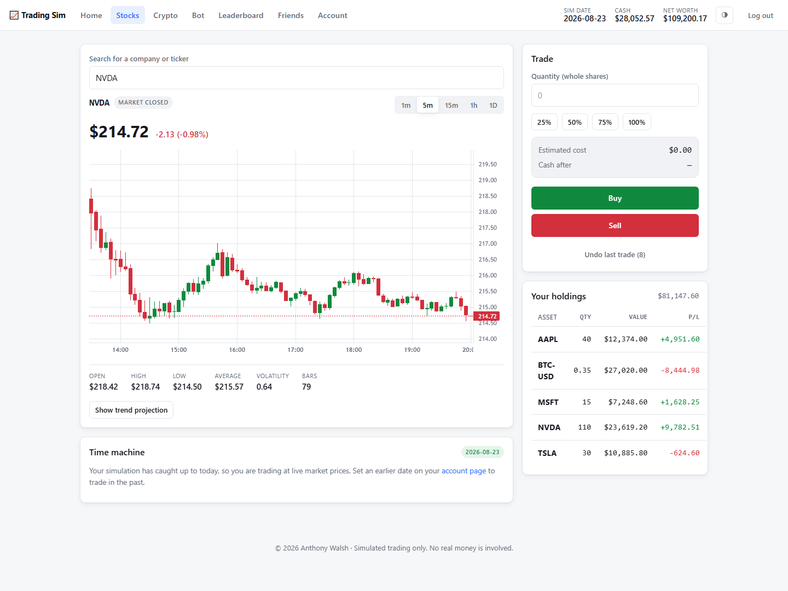
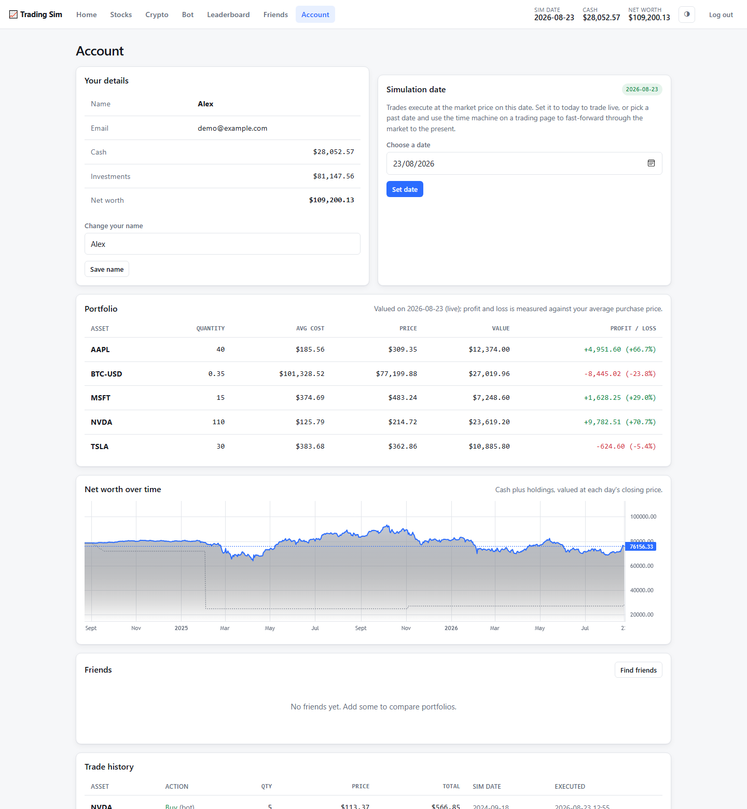
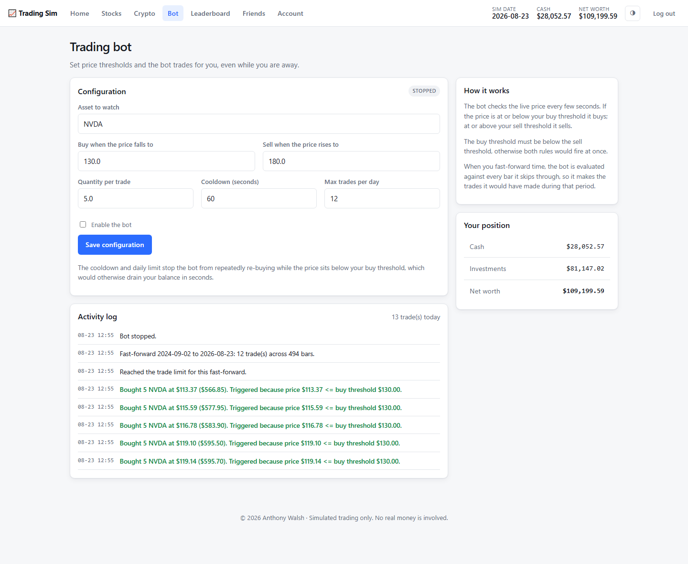
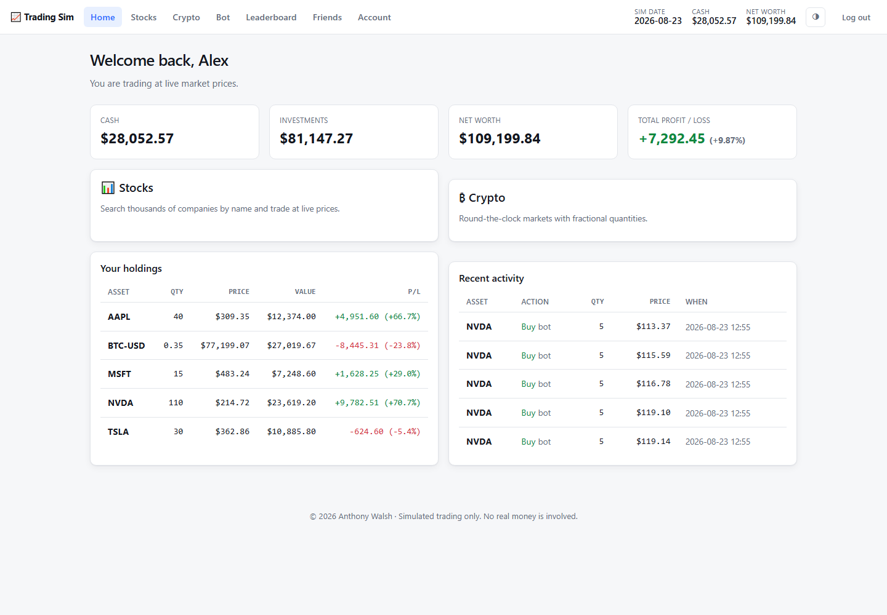
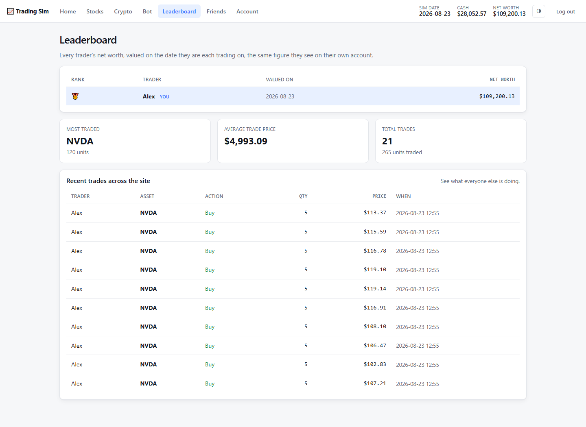

# Trading Simulator

A web trading simulator. Search real companies by name, trade equities and
cryptocurrency at live market prices with simulated money, set your account to a
date in the past and trade the market as it was, run an automated trading bot,
and fast-forward through history to see how a strategy would have played out.

Built with Flask, SQLite and vanilla JavaScript. No API key is needed to run it.

[](https://github.com/anthonywalsh135/trading-simulator/actions/workflows/ci.yml)


```bash
pip install -r requirements.txt
python main.py
```



---

## Contents

- [What it does](#what-it-does)
- [Running it](#running-it)
- [How it is put together](#how-it-is-put-together)
- [Design decisions](#design-decisions)
- [Testing](#testing)
- [Project layout](#project-layout)

---

## What it does

**Search by company name.** Type `apple` and get Apple Inc. (AAPL), ranked so the
primary listing sorts above foreign cross-listings and derivatives. Suggestions
are debounced, cancel their own in-flight request, and are keyboard-navigable.

**Trade at live prices.** The chart updates about once a second while the market
is open, with candlesticks, selectable intervals and a summary of the session.
The chosen asset lives in the URL, so `/stocks?symbol=NVDA` is a link you can
share and a refresh you can survive.

**Simulation dates.** Every account has a simulation date, and it governs
everything on screen rather than only the price a trade fills at. Set it to today
and you trade live. Set it to a date in the past and you trade at that day's
close, your holdings are valued at that day's close, the chart ends on that day,
and the statistics underneath describe that day's session. Move the date and the
whole picture, net worth included, moves with it.

**Fast-forward time.** From a past date, replay the market up to the present. The
chart animates through the interval at up to 300x, and the trading bot is
evaluated against every bar it passes, so skipping time produces the trades your
strategy would actually have made.

**Automated trading bot.** Set a buy threshold, a sell threshold and a quantity.
The bot runs in a background thread, respects a cooldown and a daily trade limit,
and writes every decision to an activity log the browser polls.

**Portfolio tracking.** Weighted average cost per holding, with realised and
unrealised profit and loss, all measured on the simulation date. The account page
charts net worth over time, split into cash and holdings.

**Undo.** The last twenty trades can be stepped back. An undo restores the
account rather than placing a compensating trade, so the cash, the share count
and the cost basis all return to exactly what they were.

**Social features.** Friend requests, a leaderboard ranked by net worth, and a
feed of recent trades across the site.

### Screenshots

Net worth over time, built with pandas from the trade ledger and daily closing
prices, alongside the portfolio it is derived from:



The trading bot, after being fast-forwarded across two years of market history.
Every line in the log is a decision it actually made and the threshold that
triggered it:



<details>
<summary>More screenshots</summary>

**Home**



**Leaderboard**



</details>

---

## Running it

```bash
pip install -r requirements.txt
```

Copy `.env.example` to `.env` and fill it in:

```
SECRET_KEY=<generate one>            # python -c "import secrets; print(secrets.token_urlsafe(48))"
GMAIL_USER=your-sender@gmail.com     # account that sends one-time codes
GMAIL_APP_PASSWORD=<16 characters>   # https://myaccount.google.com/apppasswords
```

Then:

```bash
python main.py
```

The site runs at <http://localhost:5000>. The database is created and brought up
to date automatically on first start. Email is only needed for signing up and
resetting a password; everything else works without it.

---

## How it is put together

```
browser --> views.py     pages
        \-> api.py       json for the live parts of the interface
                |
                |-> trading.py       the only path money moves through
                |-> performance.py   net worth over time (pandas)
                |-> prediction.py    linear regression trend line
                |-> bot.py           one worker thread per active user
                |
                |-> market/          prices, with caching and failover
                |       service.py   routing, failover, degradation
                |       yahoo.py     shares, funds, indices, symbol search
                |       binance.py   cryptocurrency
                |       cache.py     in-memory TTL cache + SQLite candle store
                |
                \-> models.py        database access and the domain classes
```

Every price question goes through `MarketService`, and every trade goes through
`TradeEngine.execute`. No view function talks to a data provider or writes to the
`users` table directly.

---

## Design decisions

### Market data without an API key

The project uses public Yahoo Finance endpoints, with Binance for
cryptocurrency. Neither needs a key, which keeps credentials out of the
repository entirely rather than moving them somewhere else.

Because these endpoints are public but undocumented, `market/` defends itself: a
browser User-Agent (Yahoo rejects requests without one), explicit timeouts, retry
with exponential backoff, and, if every provider fails, the last known price
returned with a `stale` flag so the interface can show a warning instead of going
blank.

### Caching, and why the chart can poll every second

The browser asks for a price roughly once per second. Without a cache that would
be one upstream request per client per second.

`market/cache.py` holds a one-second in-memory cache shared by every caller, so a
hundred open tabs still produce at most one upstream request per second. Client
refresh rate and upstream request volume are completely separate numbers.
Historical bars, which cannot change once their period has closed, are also
cached in SQLite, so a replay is instant the second time.

### One clock

The simulation date is the reference point for every figure on screen, not just
for the price a trade fills at. `MarketService.quote_on_date` is the single
answer to "what is this worth": the live quote once the simulation has caught up
to today, that date's close otherwise, paired with the previous session's close
so a day-change figure is still available.

That rule reaches the whole interface. The chart and its summary statistics end
on the simulation date. The trade panel sizes trades from the price they will
actually fill at, so the percentage buttons mean what they say. The bot prices
its decisions the same way a manual trade does. The leaderboard values each
trader on their own date, and says which date that was.

Intraday history does not reach back indefinitely (Yahoo keeps minute bars for a
week and five-minute bars for two months), so a chart request that cannot be
served at the interval asked for is promoted to the finest one that reaches, and
the page says which is on screen.

### One path for money

Every trade goes through `TradeEngine.execute`. It takes the user as an explicit
argument rather than reading Flask's `current_user`, which is what allows the bot
to trade from a background thread, and it wraps the balance update, the ledger
entry and the holding update in a single transaction, so a partial failure cannot
leave money deducted with no shares recorded.

The balance is re-read from the database inside that transaction rather than
trusted from the passed-in object, because the bot may have traded since the
request began.

### Undo restores, it does not re-trade

The undo history is a **stack**, stored in the database. Each entry records the
price the trade executed at *and the holding as it stood before it*.

Both halves matter. Reversing at the current price would make an undo a second
real trade that could gain or lose money in its own right. But reversing at the
original price is not enough either, because executing the opposite trade
recalculates the weighted average cost rather than restoring it, which leaves a
position recorded at a purchase price it was never bought at. Restoring the
snapshot is what makes an undo an undo.

An entry that can no longer be applied, because the shares have since been sold,
is discarded with an explanation rather than left at the top of the stack
blocking every older entry behind it.

### Where pandas is used

`website/performance.py` builds the net worth history shown on the account page.
Working out what an account was worth on every day since its first trade means
lining up three things that are all indexed by date but share none of the same
dates: the trade ledger, which only has rows on days the user traded; the daily
closing prices, which only exist on days the market was open; and the calendar
itself.

Pandas does that alignment directly. The ledger is pivoted into a matrix of
symbols against dates, a cumulative sum down each column gives the position held
on each day, `reindex` onto a full daily calendar with a forward fill carries
each position and each price across the gaps, and multiplying the two aligned
frames and summing across the columns gives the value of the portfolio on every
day at once. The same job in plain Python is a nested loop over days and symbols
with a manual search backwards for the most recent price before each one.

### Object-oriented structure

`Asset` is an abstract base class defining what every tradeable asset must do;
`Stock` implements it and `Crypto` extends `Stock`. The subclass is not
cosmetic: crypto trades continuously with no market hours, allows fractional
quantities, and formats sub-dollar prices to more decimal places.

`Database` is a singleton, one instance per database file, handing out a separate
connection per thread because the bot runs in its own.

### Password hashing

`hash_algorithm` in `auth.py` is a custom pre-hash of my own design. It is
deliberately **not** relied on for security: it is applied before Werkzeug's
scrypt, which is what actually protects the password. Its docstring explains what
the function does and why a hand-written hash should never be trusted on its own.

### One-time codes

Codes are hashed before being stored in the session (which is signed but readable
by the client), expire after ten minutes, allow five attempts, and are bound to a
purpose, so a code issued for signing up cannot be replayed to authorise deleting
an account. Email is sent on a background thread so SMTP latency never blocks a
request.

---

## Testing

```bash
python -m pytest                              # everything
python -m pytest tests/test_trading.py -v
python -m pytest tests/test_simulation_date.py -v
```

108 tests. They run against a temporary database and a fake market provider, so
they never touch real data or the network. The fake provider carries a live price
*and* a price per past date, which is what lets a test tell the two apart.

Tests are named for the behaviour they pin down, and the regression tests are
named for the defect they cover: `test_buy_then_sell_restores_balance_in_the_database`
exists because selling once failed to persist the balance, and
`test_buying_shows_no_profit_until_time_moves` exists because a purchase made on
a past simulation date was valued at the live price and reported a profit that
had not happened.

---

## Project layout

```
main.py                  entry point
website/
  config.py              all configuration and paths, loaded from .env
  models.py              Database singleton + domain classes
  schema.sql             canonical schema
  migrations.py          idempotent migration runner
  market/
    provider.py          MarketDataProvider abstract base class
    yahoo.py             shares, funds, indices, symbol search
    binance.py           cryptocurrency
    cache.py             TTL cache, candle store, background refresher
    service.py           routing, failover, graceful degradation
  assets.py              Asset -> Stock -> Crypto hierarchy
  trading.py             TradeEngine: the only path money moves through
  performance.py         net worth over time, built with pandas
  bot.py                 BotManager and per-user worker threads
  prediction.py          linear regression forecast with R-squared
  auth.py                login, signup, password reset, one-time codes
  views.py               page routes
  api.py                 JSON API for the live interface
  static/css/app.css     design tokens and components
  static/js/             search, chart, trade page, history chart
  templates/
tests/                   108 tests
```

---

## Notes

All trading is simulated. No real money is involved and no payment information is
ever collected. Market data comes from public endpoints and is delayed or
approximate. Nothing here is financial advice.
